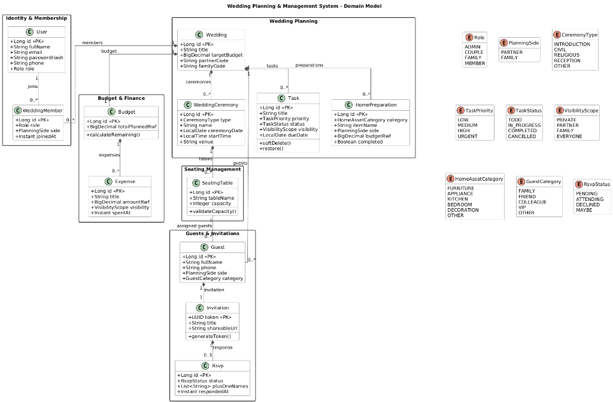
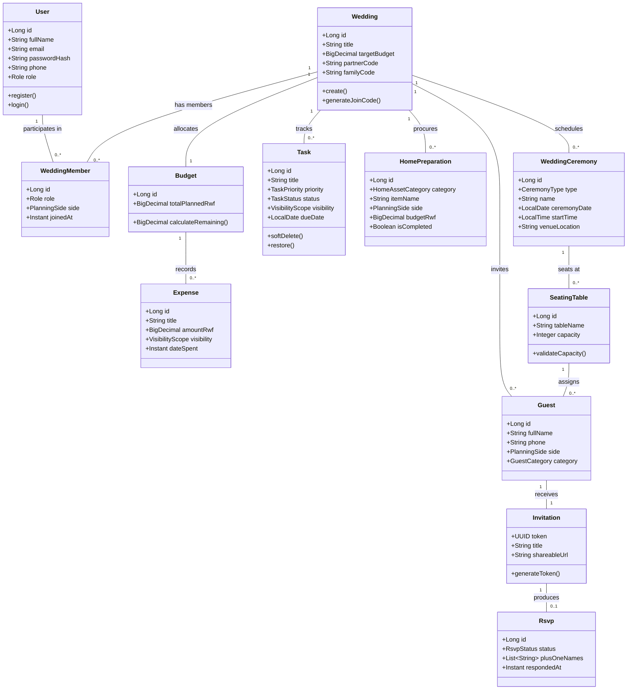

# WEDDING PLAN MANAGEMENT SYSTEM - CONCEPTUAL DOMAIN MODEL

> **Document Version:** 1.0.0  
> **Target System:** Ubukwe (Rwanda Collaborative Wedding Planning Platform)  
> **Scope:** Implementation-independent conceptual domain model, domain boundaries, entity relationships, business invariants, and visibility rules.

---

## 1. Domain Overview & Boundaries

The **Ubukwe** domain represents a centralized, multi-tenant wedding planning ecosystem tailored to Rwandan cultural workflows (Gusaba/Gukora Irembo, Civil Marriage, Religious Ceremony, and Reception). 

The core domain is structured around three primary architectural boundaries:

```
+-----------------------------------------------------------------------------------+
|                                 WEDDING DOMAIN                                    |
|                                                                                   |
|  +---------------------------+  +---------------------------+  +----------------+ |
|  |     BRIDE PRIVATE AREA    |  |     GROOM PRIVATE AREA    |  |  SHARED AREA   | |
|  |                           |  |                           |  |                | |
|  | - Bride Tasks & Expenses  |  | - Groom Tasks & Expenses  |  | - Ceremonies   | |
|  | - Bride Home Prep Items   |  | - Groom Home Prep Items   |  | - Venue/Food   | |
|  | - Bride Support Accounts  |  | - Groom Support Accounts  |  | - Budget Alloc | |
|  +---------------------------+  +---------------------------+  +----------------+ |
|                                                                                   |
|  +-----------------------------------------------------------------------------+  |
|  |                        GUEST & INVITATIONS BOUNDARY                         |  |
|  |  - Digital Invitations (UUID Token)  - RSVP & Plus-Ones  - Seating Tables     |  |
|  +-----------------------------------------------------------------------------+  |
|                                                                                   |
|  +-----------------------------------------------------------------------------+  |
|  |                     OPERATIONAL AUDIT & GOVERNANCE                          |  |
|  |  - Rwandan Cultural Templates    - Activity Audits    - Admin Governance   |  |
|  +-----------------------------------------------------------------------------+  |
+-----------------------------------------------------------------------------------+
```

---

## 2. Domain Entities & Value Objects

### 2.1 Core Entities

#### User
Represents a human actor interacting with the platform.
- **Attributes:** Full Name, Email Address, Hashed Password, Telephone Number, Role.
- **Invariants:**
  - Email address must be globally unique across all accounts.
  - User password must be stored as an irreversible cryptographic hash (BCrypt).

#### Wedding
The central domain context representing a specific couple's wedding event.
- **Attributes:** Title/Name, Target Budget, Partner Join Code, Family Support Invitation Code, Created Date.
- **Invariants:**
  - A Wedding must have at most 1 Bride account and at most 1 Groom account bound to it.
  - Partner join codes must be unique and auto-revoked after successful redemption.

#### WeddingMember
Defines the association between a User and a Wedding, establishing their specific role and side permission.
- **Attributes:** User, Wedding, Role, Side (`BRIDE_SIDE`, `GROOM_SIDE`, `SHARED`), Date Joined.
- **Invariants:**
  - At most **2 family support accounts** per side (`BRIDE_SIDE` max 2, `GROOM_SIDE` max 2).
  - A member cannot switch sides without explicit owner authorization.

#### WeddingCeremony
Represents a distinct, scheduled wedding event with individual dates, venues, and itineraries.
- **Attributes:** Ceremony Type (`GUSABA`, `CIVIL`, `RELIGIOUS`, `RECEPTION`), Title, Date, Start Time, Venue Location, Description.
- **Invariants:**
  - Ceremony dates must fall within valid wedding planning timeframes.
  - Ceremonies can be linked to specific event tasks and guest seating tables.

#### Task
A planning action or milestone required to organize the wedding or ceremonies.
- **Attributes:** Title, Category, Assignee, Due Date, Priority (`LOW`, `MEDIUM`, `HIGH`), Status (`PENDING`, `IN_PROGRESS`, `COMPLETED`), Visibility Scope (`BRIDE_PRIVATE`, `GROOM_PRIVATE`, `SHARED`), Budget Allocation.
- **Invariants:**
  - Tasks marked `BRIDE_PRIVATE` are strictly inaccessible to Groom side members.
  - Tasks marked `GROOM_PRIVATE` are strictly inaccessible to Bride side members.
  - Soft-deleted tasks preserve audit history and support immediate Undo/Restore.

#### HomePreparation
Independent household setup module tracking procurement of new-home assets prior to cohabitation.
- **Attributes:** Asset Category (`APPLIANCES`, `FURNITURE`, `KITCHENWARE`, `BEDDING`, `RENT_UTILITIES`), Item Name, Assigned Responsible Side, Target Budget, Completion Flag.
- **Invariants:**
  - Tracks household setup separately from ceremony event expenses.

#### Budget & Expense
Financial planning entities tracking planned allocations versus actual spending in Rwandan Francs (RWF).
- **Attributes:** 
  - *Budget:* Total Target Amount, Category Allocations.
  - *Expense:* Title, Category, Amount (RWF), Paid By, Payment Date, Visibility Scope (`BRIDE_PRIVATE`, `GROOM_PRIVATE`, `SHARED`).
- **Invariants:**
  - Expense amounts must strictly be positive non-zero values (`amount > 0`).
  - Financial calculations (`totalPlanned`, `totalSpent`, `remaining`) are computed server-side in RWF integer precision without floating-point rounding.

#### Guest, Invitation & RSVP
Public-facing guest communication and attendance tracking.
- **Attributes:** 
  - *Guest:* Full Name, Telephone Number, Category (`VIP`, `FAMILY`, `FRIEND`), Side (`BRIDE_SIDE`, `GROOM_SIDE`), Assigned Table.
  - *Invitation:* Unique 36-character UUID Token, Shared URL, Event Details, Dispatch Status.
  - *RSVP:* Attendance Status (`ATTENDING`, `DECLINED`, `PENDING`), Plus-One Names, Dietary Notes, Timestamp.
- **Invariants:**
  - Invitation token must be un-guessable (UUID v4).
  - RSVP submissions do not require user authentication but are protected by phone verification and rate limiting (10 req/min).

#### SeatingTable & GuestSeating
Seating allocation for reception and ceremony venues.
- **Attributes:** Table Name/Number, Capacity Limit, Assigned Guests List.
- **Invariants:**
  - A Guest cannot be assigned to multiple tables simultaneously for the same ceremony.
  - Total assigned guests cannot exceed the Table Capacity Limit without explicit warning.

---

## 3. High-Level UML Class Diagram





---

## 4. Formal Use Case Specifications & Acceptance Criteria

### Use Case 1: UC-01 — Side-Isolated Task & Home Prep Management

| Field | Specification |
| :--- | :--- |
| **Actor** | Bride, Groom, Bride Support, Groom Support |
| **Precondition** | User is authenticated via JWT and bound to an active Wedding with a declared side (`BRIDE_SIDE` or `GROOM_SIDE`). |
| **Main Flow** | 1. User navigates to Tasks or Home Preparation area.<br>2. User creates a new Task/Home Prep item specifying visibility (`BRIDE_PRIVATE`, `GROOM_PRIVATE`, or `SHARED`).<br>3. Server validates inputs, enforces permissions, and persists the record.<br>4. The new item displays immediately on the user's dashboard. |
| **Alternative Flow** | 3a. Opposite-side user or unauthorized user attempts to view/edit the private item using its direct ID.<br>3b. Server rejects the request with HTTP `403 Forbidden` (IDOR Protection). |

#### Acceptance Criteria
1. Given a Bride user, when creating a task with scope `BRIDE_PRIVATE`, it is persisted and visible strictly to Bride and Bride Support accounts.
2. Given a Groom user querying list endpoints, `BRIDE_PRIVATE` items are completely omitted from the JSON response.
3. Given a direct `GET /api/v1/tasks/{brideTaskId}` request from a Groom JWT, the server responds with HTTP `403 Forbidden`.

---

### Use Case 2: UC-02 — Digital Invitation & Public Guest RSVP

| Field | Specification |
| :--- | :--- |
| **Actor** | Unauthenticated Guest |
| **Precondition** | Guest receives a shareable invitation link containing a 36-character UUID token (`/rsvp/:token`). |
| **Main Flow** | 1. Guest opens the invitation URL on their mobile or web browser.<br>2. Server validates token authenticity and displays ceremony details.<br>3. Guest verifies their telephone number, specifies attendance (`ATTENDING` / `DECLINED`), and enters full names of plus-ones.<br>4. Guest submits RSVP.<br>5. Server updates Guest status, publishes an async RabbitMQ message to notify the couple, and displays a confirmation message. |
| **Alternative Flow** | 2a. Token is invalid or expired: Server returns HTTP `404 Not Found`.<br>4a. Rate limit exceeded (>10 requests/min per IP): Server returns HTTP `429 Too Many Requests`. |

#### Acceptance Criteria
1. Opening `/api/v1/public/invitations/{token}` returns invitation details without requiring authentication headers.
2. Submitting valid RSVP updates guest attendance status and captures all plus-one names accurately.
3. Submitting an RSVP publishes a message to `wedding.rsvp.notifications` RabbitMQ queue.
4. Repeated requests exceeding 10 req/min return `429 Too Many Requests`.

---

### Use Case 3: UC-03 — OAuth2 Social Authentication & JWT Issuance

| Field | Specification |
| :--- | :--- |
| **Actor** | New or Returning User |
| **Precondition** | User clicks "Log in with Google" or "Log in with GitHub" on the login screen. |
| **Main Flow** | 1. User authenticates with OAuth2 Provider (Google/GitHub).<br>2. Provider redirects to server callback with authorization code.<br>3. Server exchanges code for OAuth2 tokens, fetches user email and profile.<br>4. Server matches or creates internal `User` entity, generates stateless JWT, and returns `AuthResponse`.<br>5. Frontend stores JWT token and redirects to Overview dashboard. |
| **Alternative Flow** | 3a. OAuth2 provider authorization fails or is cancelled: Server redirects to login screen with error message. |

#### Acceptance Criteria
1. Successful OAuth2 authentication issues a valid stateless JWT token with 24-hour expiration.
2. If the user email does not exist in the database, a new `User` record is created automatically with standard default role assignment.
3. The issued JWT token allows access to protected API endpoints matching user permissions.
